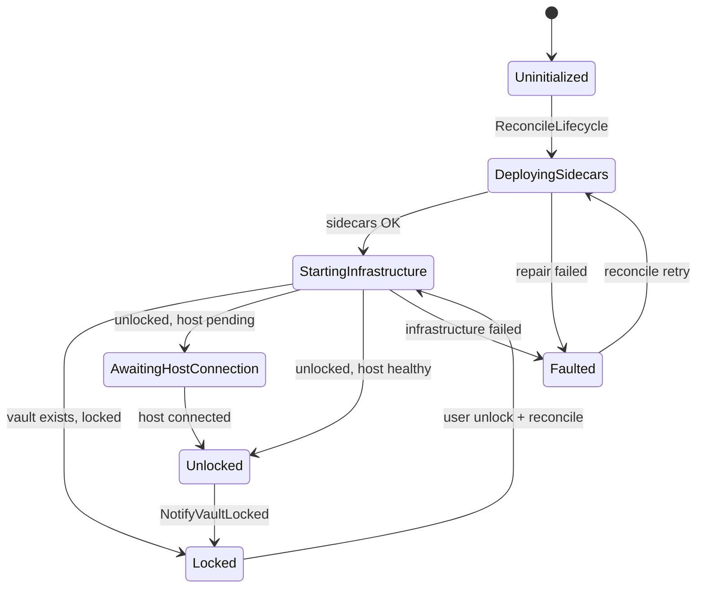
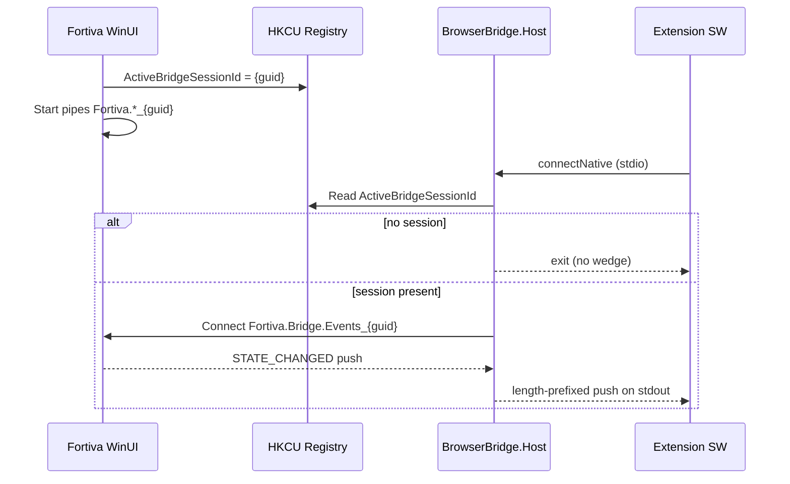

# Fortiva Browser Bridge Architecture

Fortiva’s browser integration connects a Chromium extension, a native messaging host (`Fortiva.BrowserBridge.Host`), and the WinUI desktop app through **session-scoped named pipes** and a **single lifecycle coordinator**. This document captures the design after the Phase 1–4 refactor (v1.0.28+) and the operational rules that prevent regression.

## Problem the refactor solved

Before the coordinator model, bridge readiness was inferred from scattered heal loops, watchdog timers, and composite boolean flags across `MainWindow`, `SettingsPage`, `App.xaml.cs`, and extension setup helpers. That produced:

- Orphan `Fortiva.BrowserBridge.Host` processes after lock/unlock cycles
- Split-brain `ping=locked` vs `ping=ready` responses
- Global pipe names that could wedge when a stale host held a listener
- Extension polling loops with multi-second latency

The replacement is a **deterministic state machine** with **one write gate** for lifecycle side effects.

## Component overview

| Layer | Responsibility |
|-------|----------------|
| **Extension** (`extension/background.js`, `popup.js`) | Persistent `connectNative` port; caches push snapshots; serves ping from memory |
| **Native host** (`Fortiva.BrowserBridge.Host`) | stdin/stdout request pump + event-pipe push fan-out; exits when no active session |
| **WinUI app** (`ShellViewModel`, `BridgeCoordinator`) | Vault unlock, pipe servers, session registry, hash sidecars, host cleanup |
| **Core** (`VaultSession`, brokers, `BridgePipeNaming`) | Credential/token/unlock/event pipes bound to session GUID |

## BridgeCoordinator state machine

`BridgeCoordinator.ReconcileLifecycleAsync()` is the **only** entry point that may:

- Rotate `ActiveBridgeSessionId`
- Stop/restart native hosts (`BridgeHostProcessCleanup`)
- Repair native-messaging hash sidecars
- Transition `BridgeReadyState` and push `STATE_CHANGED` to connected hosts



Sequential states are represented exclusively by `BridgeReadyState` — never by ad-hoc `(isUnlocked && isBridgeReady && …)` composites in UI or extension code.

## Three operational rules

### 1. Coordinator inviolability

**Only `BridgeCoordinator.ReconcileLifecycleAsync()`** (via `ShellViewModel.ReconcileBridgeLifecycleAsync`) may:

- Terminate or restart `Fortiva.BrowserBridge.Host` processes
- Rotate session GUIDs for production lifecycle changes (except the **placeholder** rotation in `RestartBridgeUnlockBroker` at cold start — see below)
- Repair install sidecars and native-messaging manifests as part of lifecycle

Do **not** add `Process.Kill("Fortiva.BrowserBridge.Host")`, pipe restarts, or hash repairs in feature code, autofill paths, or settings pages. Call `ReconcileBridgeLifecycleAsync(triggerReason)` instead.

### 2. Stream separation

| Traffic | Channel |
|---------|---------|
| Interactive commands (`ping`, `prepare_fill`, `execute_fill`) | Native messaging **stdin/stdout** (length-prefixed JSON) |
| State snapshots, session token hints | **`Fortiva.Bridge.Events_{sessionId}`** push pipe only |

Never embed lifecycle/state payloads in the request/response stdin loop. Never poll stdout for state when a push is available.

### 3. Pure enum state

All readiness and UI mapping derive from **`BridgeReadyState`** via `BridgePresenceSnapshot` and `BridgeSnapshotPush.MapPingStatus`. Forbidden patterns:

- New boolean gates like `_bridgeReady && _hostConnected`
- Parallel status enums in the extension
- Legacy string protocols except the documented STATUS lines on the unlock broker

Extend lifecycle by adding **sequential** enum values and coordinator transitions — not composite flags.

## Session-bound GUID registry

Discovery contract between WinUI (writer) and native host (reader):



### Registry location

```
HKCU\Software\ICITPROJ\Fortiva\Personal\ActiveBridgeSessionId   (REG_SZ)
HKCU\Software\ICITPROJ\Fortiva\Enterprise\ActiveBridgeSessionId (REG_SZ)
```

### Pipe names (all suffixed with `_{sessionId}`)

| Prefix | Purpose |
|--------|---------|
| `Fortiva.BrowserBridge` | Credential IPC |
| `Fortiva.Bridge.Token` | Session token broker |
| `Fortiva.Bridge.UnlockRequest` | Lock/unlock STATUS + UNLOCK (WinUI listener) |
| `Fortiva.Bridge.Events` | Push stream to native host → extension |

Implementation: `BridgePipeNaming.cs`, `BridgeSessionRegistry.cs`.

### Locked vault behavior

When the vault is **locked**:

- No credential pipes are exposed to the native host (host exits if registry is cleared)
- WinUI still runs **`BridgeUnlockBroker`** on the session unlock pipe so the extension can request unlock
- On cold start, `RestartBridgeUnlockBroker()` **rotates a placeholder session** if none exists so listeners bind before the first `ReconcileBridgeLifecycleAsync` pass

## Phase 5: push snapshot and token cache

When state transitions to `Unlocked`, `BridgeCoordinator.GetAuthoritativeSnapshot()` attaches `CachedSessionToken`. `BridgeEventBroadcaster` emits:

```json
{
  "type": "STATE_CHANGED",
  "state": "Unlocked",
  "cachedSessionToken": "...",
  "ok": true,
  "status": "ready"
}
```

The extension service worker caches this in memory; `popup.js` subscribes to `bridge_state_updated` instead of polling.

## Enterprise vs Personal

| | Personal | Enterprise |
|---|----------|------------|
| Native messaging registry | HKCU (user) | HKLM (machine) + installer |
| Extension install | Manual / Connect browser | `ExtensionInstallForcelist` |
| Intune packaging | N/A | `packaging/intune/` |

## Key source files

| Area | Path |
|------|------|
| Coordinator | `src/Fortiva.Core/Services/BridgeCoordinator.cs` |
| State enum | `src/Fortiva.Core/BrowserBridge/BridgeReadyState.cs` |
| Pipes / registry | `src/Fortiva.Core/BrowserBridge/BridgePipeNaming.cs`, `BridgeSessionRegistry.cs` |
| Push | `src/Fortiva.Core/BrowserBridge/BridgeEventBroadcaster.cs`, `BridgePushMessage.cs` |
| Native pump | `src/Fortiva.Core/BrowserBridge/NativeMessagingHostPump.cs` |
| Framing | `src/Fortiva.Core/BrowserBridge/NativeMessagingFraming.cs` |
| WinUI gate | `src/Fortiva.AppHost/ViewModels/ShellViewModel.cs` |
| Extension | `extension/background.js`, `extension/popup.js` |
| CI gate | `scripts/Test-InstallerQa.ps1` |

## Review checklist

Before merging bridge-related changes, confirm:

1. No new lifecycle writes outside `BridgeCoordinator`
2. No state over stdin/stdout except request/response pairs
3. No new boolean readiness flags — use `BridgeReadyState`
4. Pipe names use `BridgePipeNaming` session suffixes
5. Tests run serially for bridge collections (`BrowserBridgeSerial`)
