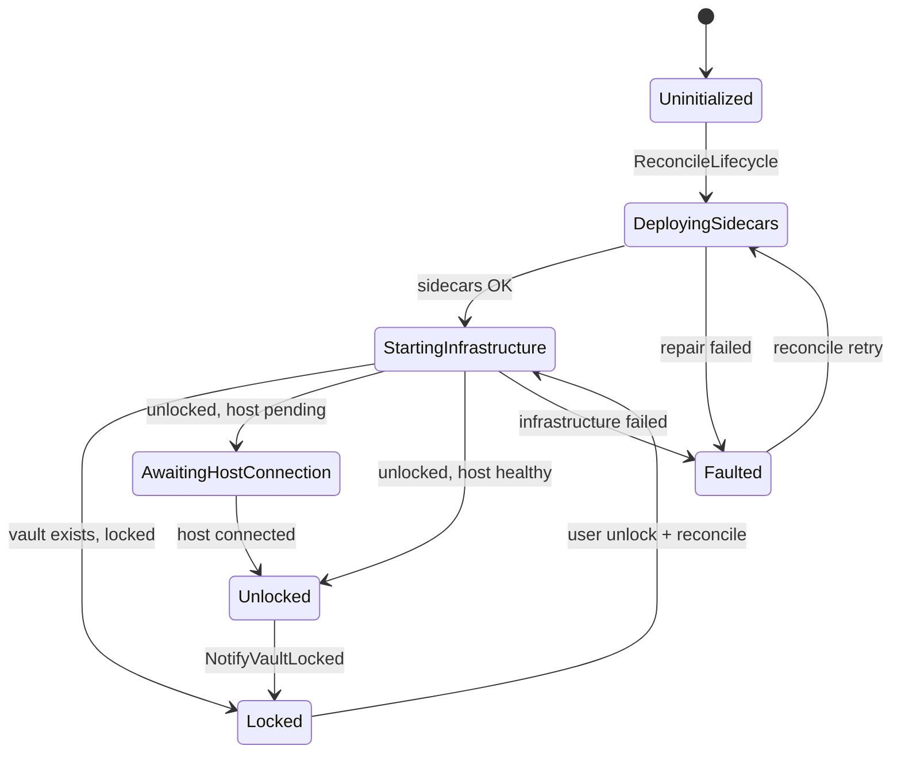
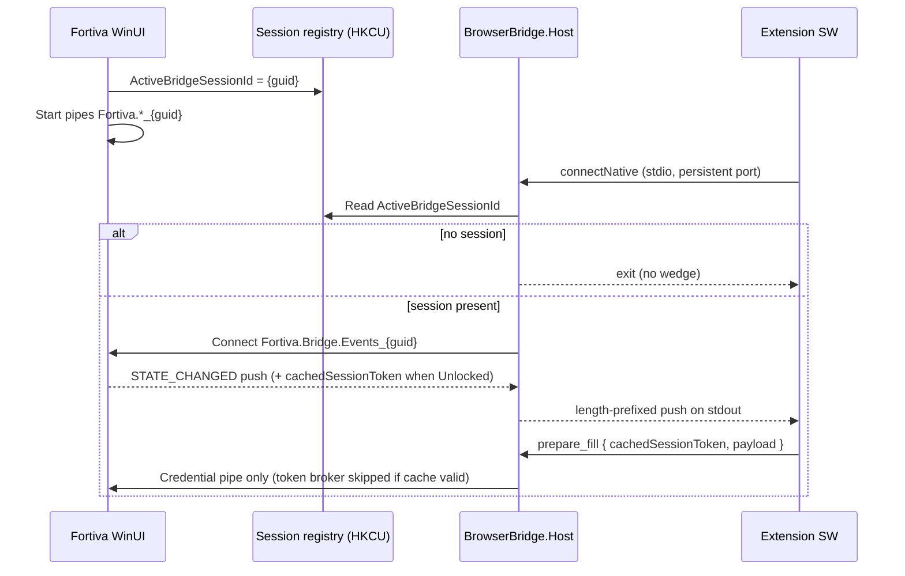
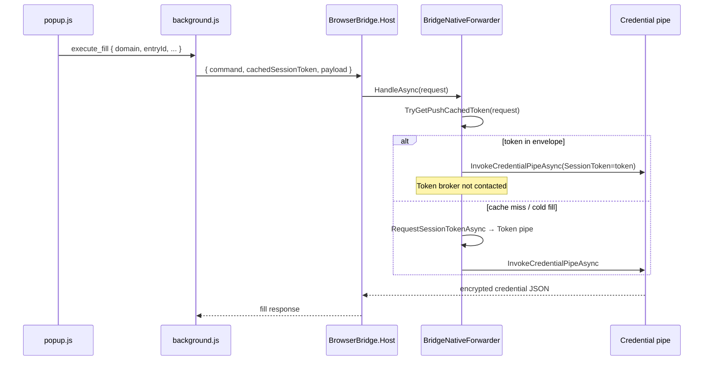
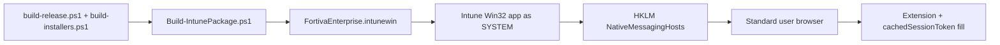

# Fortiva Browser Bridge Architecture

Fortiva’s browser integration connects a Chromium extension, a native messaging host (`Fortiva.BrowserBridge.Host`), and the WinUI desktop app through **session-scoped named pipes**, a **single lifecycle coordinator**, and a **push-first state channel**. This document captures the design after the Phase 1–4 refactor (v1.0.28+), Phase 5 push snapshots (v1.0.31+), and the unified enterprise + zero-latency autofill layer (v1.0.32+, commit `ee8dbf8`).

## Problem the refactor solved

Before the coordinator model, bridge readiness was inferred from scattered heal loops, watchdog timers, and composite boolean flags across `MainWindow`, `SettingsPage`, `App.xaml.cs`, and extension setup helpers. That produced:

- Orphan `Fortiva.BrowserBridge.Host` processes after lock/unlock cycles
- Split-brain `ping=locked` vs `ping=ready` responses
- Global pipe names that could wedge when a stale host held a listener
- Extension polling loops with multi-second latency
- Per-fill round-trips to `Fortiva.Bridge.Token_{guid}` even when the vault was already unlocked

The replacement is a **deterministic state machine** with **one write gate** for lifecycle side effects, **push snapshots** for UI readiness, and **in-memory session tokens** on fill requests to eliminate redundant token-broker IPC.

## End-state pipeline (Personal and Enterprise)

```text
[Desktop / Corporate device]
   └── Fortiva WinUI unlocks vault
        ├── BridgeCoordinator writes ActiveBridgeSessionId + starts session pipes
        ├── BridgeEventBroadcaster pushes STATE_CHANGED (+ cachedSessionToken) on Events pipe
        └── Native host fans push to extension service worker (persistent connectNative port)
             │
             ▼
[Browser — standard user, no admin rights required on Enterprise]
   └── Extension caches snapshot + cachedSessionToken in background memory
        └── Fill click → prepare_fill / execute_fill envelope includes cachedSessionToken
             └── BridgeNativeForwarder.TryGetPushCachedToken() → credential pipe only
                  (skips Fortiva.Bridge.Token_{guid} when cache is warm)
```

On **Enterprise** endpoints, Intune deploys the Win32 app as `SYSTEM`, writes **HKLM** native-messaging keys, and Proactive Remediation repairs drift daily — see [Enterprise distribution](#enterprise-distribution-intune--endpoint-manager) below.

## Component overview

| Layer | Responsibility |
|-------|----------------|
| **Extension** (`extension/background.js`, `popup.js`) | Persistent `connectNative` port; caches push snapshots + `cachedSessionToken`; injects token into fill envelopes; serves ping from memory |
| **Native host** (`Fortiva.BrowserBridge.Host`) | stdin/stdout request pump + event-pipe push fan-out; `BridgeNativeForwarder` for credential commands; exits when no active session |
| **WinUI app** (`ShellViewModel`, `BridgeCoordinator`) | Vault unlock, pipe servers, session registry, hash sidecars, host cleanup |
| **Core** (`VaultSession`, brokers, `BridgePipeNaming`, `BridgeNativeForwarder`) | Credential/token/unlock/event pipes bound to session GUID; token bypass on fill |

## BridgeCoordinator state machine

`BridgeCoordinator.ReconcileLifecycleAsync()` is the **only** entry point that may:

- Rotate `ActiveBridgeSessionId`
- Stop/restart native hosts (`BridgeHostProcessCleanup`)
- Repair native-messaging hash sidecars
- Transition `BridgeReadyState` and push `STATE_CHANGED` to connected hosts



Sequential states are represented exclusively by `BridgeReadyState` — never by ad-hoc `(isUnlocked && isBridgeReady && …)` composites in UI or extension code.

## Three operational rules

### 1. Coordinator inviolability

**Only `BridgeCoordinator.ReconcileLifecycleAsync()`** (via `ShellViewModel.ReconcileBridgeLifecycleAsync`) may:

- Terminate or restart `Fortiva.BrowserBridge.Host` processes
- Rotate session GUIDs for production lifecycle changes (except the **placeholder** rotation in `RestartBridgeUnlockBroker` at cold start — see below)
- Repair install sidecars and native-messaging manifests as part of lifecycle

Do **not** add `Process.Kill("Fortiva.BrowserBridge.Host")`, pipe restarts, or hash repairs in feature code, autofill paths, or settings pages. Call `ReconcileBridgeLifecycleAsync(triggerReason)` instead.

### 2. Stream separation

| Traffic | Channel |
|---------|---------|
| Interactive commands (`ping`, `prepare_fill`, `execute_fill`) | Native messaging **stdin/stdout** (length-prefixed JSON) |
| Lifecycle state snapshots (`STATE_CHANGED`, readiness, token **publication**) | **`Fortiva.Bridge.Events_{sessionId}`** push pipe only |

Never embed lifecycle/state payloads in the request/response stdin loop as unsolicited pushes. Never poll stdout for state when a push is available.

**Allowed on stdin:** fill commands may include `cachedSessionToken` (or `sessionToken`) as **request authentication metadata** copied from the last push — this is not lifecycle traffic; it avoids a second pipe round-trip. The host validates the token on the credential pipe (`SessionToken` field); it does not re-fetch from the token broker when the envelope already carries a valid pushed token.

### 3. Pure enum state

All readiness and UI mapping derive from **`BridgeReadyState`** via `BridgePresenceSnapshot` and `BridgeSnapshotPush.MapPingStatus`. Forbidden patterns:

- New boolean gates like `_bridgeReady && _hostConnected`
- Parallel status enums in the extension
- Legacy string protocols except the documented STATUS lines on the unlock broker

Extend lifecycle by adding **sequential** enum values and coordinator transitions — not composite flags.

## Session-bound GUID registry

Discovery contract between WinUI (writer) and native host (reader):



### Registry location

```
HKCU\Software\ICITPROJ\Fortiva\Personal\ActiveBridgeSessionId   (REG_SZ)
HKCU\Software\ICITPROJ\Fortiva\Enterprise\ActiveBridgeSessionId (REG_SZ)
```

Enterprise **native messaging manifest** paths are machine-wide (HKLM); session GUID registry remains per-user under HKCU so each interactive user gets an isolated pipe namespace.

### Pipe names (all suffixed with `_{sessionId}`)

| Prefix | Purpose |
|--------|---------|
| `Fortiva.BrowserBridge` | Credential IPC (`list_credentials`, `get_credentials`) |
| `Fortiva.Bridge.Token` | Session token broker (fallback when push cache absent or stale) |
| `Fortiva.Bridge.UnlockRequest` | Lock/unlock STATUS + UNLOCK (WinUI listener) |
| `Fortiva.Bridge.Events` | Push stream to native host → extension |

Implementation: `BridgePipeNaming.cs`, `BridgeSessionRegistry.cs`.

### Locked vault behavior

When the vault is **locked**:

- No credential pipes are exposed to the native host (host exits if registry is cleared)
- WinUI still runs **`BridgeUnlockBroker`** on the session unlock pipe so the extension can request unlock
- On cold start, `RestartBridgeUnlockBroker()` **rotates a placeholder session** if none exists so listeners bind before the first `ReconcileBridgeLifecycleAsync` pass

## Phase 5: push snapshot and token cache

When state transitions to `Unlocked`, `BridgeCoordinator.GetAuthoritativeSnapshot()` attaches `CachedSessionToken`. `BridgeEventBroadcaster` emits:

```json
{
  "schemaVersion": 1,
  "type": "STATE_CHANGED",
  "state": "Unlocked",
  "cachedSessionToken": "...",
  "ok": true,
  "status": "ready"
}
```

Extensions ignore unknown fields; `schemaVersion` lets future clients detect payload shape changes without misinterpreting new properties.

The extension service worker stores this in `cachedSessionToken` / `currentBridgeSnapshot`; `popup.js` subscribes to `bridge_state_updated` instead of polling.

## Phase 5+: zero-latency autofill (token bypass)

When the vault is unlocked and the push cache is warm, fill requests **must not** open `Fortiva.Bridge.Token_{guid}`.



**Extension envelope** (via `credentialEnvelope()` in `background.js`):

```json
{
  "command": "prepare_fill",
  "cachedSessionToken": "YOUR_SECURE_SESSION_GUID",
  "payload": { "domain": "login.example.com", "url": "https://..." }
}
```

**Host handling** (`BridgeNativeForwarder.EnsureSessionTokenAsync`):

1. `TryGetPushCachedToken(request)` — reads `cachedSessionToken` / `sessionToken` from root or `payload`
2. If present, use immediately for `InvokeCredentialPipeAsync`
3. Otherwise fall back to unlock flow + `RequestSessionTokenAsync` (token broker pipe)

Token broker round-trips remain for cold start, lock/unlock transitions, and cache miss — not for every Fill click on a warm unlocked session.

## Native host I/O hardening

| Concern | Implementation |
|---------|----------------|
| Framing | `NativeMessagingFraming` — little-endian 4-byte length prefix on stdout |
| Concurrent push + response | `NativeMessagingHostPump` — `SemaphoreSlim` serializes stdout writes |
| Host restart storm | `BridgeHostCircuitBreaker` — 5 exits / 30s → 10s backoff before next launch |
| Port hygiene | `background.js` — teardown/reconnect on disconnect; single pending request slot |
| Integrity | `bridge-host.sha256` sidecar verified on Enterprise repair paths |

## Enterprise vs Personal

| | Personal | Enterprise |
|---|----------|------------|
| Native messaging registry | HKCU (user) | **HKLM** (machine) — `com.fortiva.browserbridge.enterprise` |
| Extension install | Manual / Connect browser | `ExtensionInstallForcelist` + CRX update manifest |
| Session registry | HKCU `ActiveBridgeSessionId` | HKCU (same — per interactive user) |
| IT deployment | GitHub Releases installer | Intune Win32 `.intunewin` + optional Proactive Remediation |
| Autofill token path | Push cache + bypass | Same — non-admin users rely on HKLM host binding only |

## Enterprise distribution (Intune / Endpoint Manager)

Corporate rollout uses a unified packaging pipeline under `packaging/intune/`:



| Script | Role |
|--------|------|
| `Build-IntunePackage.ps1` | Stage setup EXE + provisioning scripts; run `IntuneWinAppUtil.exe` → `dist/intune/FortivaEnterprise.intunewin` |
| `Install-FortivaEnterprise.ps1` | Silent `/VERYSILENT` install + post-install HKLM repair |
| `Detect-FortivaEnterprise.ps1` | Custom detection: `Fortiva.Enterprise.exe` + HKLM native messaging for **installed** Chromium browsers only |
| `Deploy-Intune.ps1` | Write `{InstallRoot}\NativeMessaging\*.json` + register HKLM keys; `-Remediation` for silent daily drift repair |
| `intune-package.json` | Portal metadata (install/uninstall commands, script names) |

**HKLM detection contract** (browser-conditional):

| Condition | Required |
|-----------|----------|
| Always | `Fortiva.Enterprise.exe` under `%ProgramFiles%\icmclab studio\Fortiva Enterprise\` |
| Google Chrome installed | `HKLM\SOFTWARE\Google\Chrome\NativeMessagingHosts\com.fortiva.browserbridge.enterprise` → existing manifest JSON |
| Microsoft Edge installed | `HKLM\SOFTWARE\Microsoft\Edge\NativeMessagingHosts\com.fortiva.browserbridge.enterprise` → existing manifest JSON |
| Neither browser installed | EXE check only (server/VDA image with no Chromium) |

Default manifest path: `{ProgramFiles}\icmclab studio\Fortiva Enterprise\NativeMessaging\com.fortiva.browserbridge.enterprise.json`

Operational detail: [`packaging/intune/README.md`](../packaging/intune/README.md).

## Key source files

| Area | Path |
|------|------|
| Coordinator | `src/Fortiva.Core/Services/BridgeCoordinator.cs` |
| State enum | `src/Fortiva.Core/BrowserBridge/BridgeReadyState.cs` |
| Pipes / registry | `src/Fortiva.Core/BrowserBridge/BridgePipeNaming.cs`, `BridgeSessionRegistry.cs` |
| Push | `src/Fortiva.Core/BrowserBridge/BridgeEventBroadcaster.cs`, `BridgePushMessage.cs` |
| Fill / token bypass | `src/Fortiva.Core/BrowserBridge/BridgeNativeForwarder.cs` |
| Host circuit breaker | `src/Fortiva.Core/BrowserBridge/BridgeHostCircuitBreaker.cs` |
| Native pump | `src/Fortiva.Core/BrowserBridge/NativeMessagingHostPump.cs` |
| Framing | `src/Fortiva.Core/BrowserBridge/NativeMessagingFraming.cs` |
| WinUI gate | `src/Fortiva.AppHost/ViewModels/ShellViewModel.cs` |
| Extension | `extension/background.js`, `extension/popup.js` |
| Enterprise Intune | `packaging/intune/` |
| Startup regression test | `tests/Fortiva.Core.Tests/BrowserBridge/BridgeSessionStartupTests.cs` |
| Token bypass tests | `tests/Fortiva.Core.Tests/BrowserBridge/BridgeNativeForwarderTests.cs` |
| CI gate | `scripts/Test-InstallerQa.ps1` |

## Review checklist

Before merging bridge-related changes, confirm:

1. No new lifecycle writes outside `BridgeCoordinator`
2. No unsolicited lifecycle state over stdin/stdout (push pipe only for `STATE_CHANGED`)
3. Fill commands may pass `cachedSessionToken` for auth bypass — do not reintroduce token-broker calls when envelope already carries a valid token
4. No new boolean readiness flags — use `BridgeReadyState`
5. Pipe names use `BridgePipeNaming` session suffixes
6. Enterprise HKLM keys remain `com.fortiva.browserbridge.enterprise` (not Personal host name)
7. Tests run serially for bridge collections (`BrowserBridgeSerial`)
8. Bump `BridgePushMessage.CurrentSchemaVersion` when changing push payload shape; keep extension tolerant of unknown fields

## Architecture roadmap (senior review backlog)

Items below are **not blockers** for the current release. They harden resilience, observability, and fleet variance without breaking coordinator inviolability.

| Priority | Item | Rationale | Status |
|----------|------|-----------|--------|
| Done | `schemaVersion` on push payloads | Forward-compatible extension parsing | v1.0.32+ |
| Done | Browser-conditional Intune detection | Chrome-only / Edge-only fleets avoid false non-compliance | `Detect-FortivaEnterprise.ps1` |
| Done | Native host **circuit breaker** | Cap exit/restart storms (5 exits / 30s → 10s backoff) | `BridgeHostCircuitBreaker.cs` |
| **Rejected** | Coordinator watchdog duplicating lifecycle | Coordinator remains single writer; observability via existing reconcile triggers | — |
| **Rejected** | Move session GUID out of HKCU registry | Browsers require registry for native messaging; session pipes already rotate on GUID change | — |
| Planned | Credential pipe **concurrency cap** | Parallel fills / bulk flows without serialising everything | — |
| Done | Auto `-Version` on local `build-installers.ps1` | Reads `Directory.Build.props`; CI release workflow already passes explicit version | — |

End-to-end validation record: [`BRIDGE-VALIDATION.md`](BRIDGE-VALIDATION.md).
